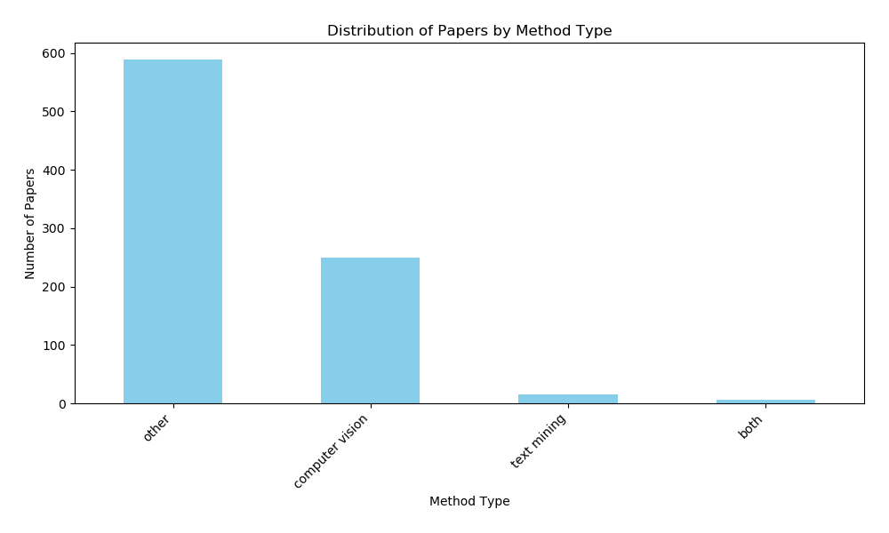
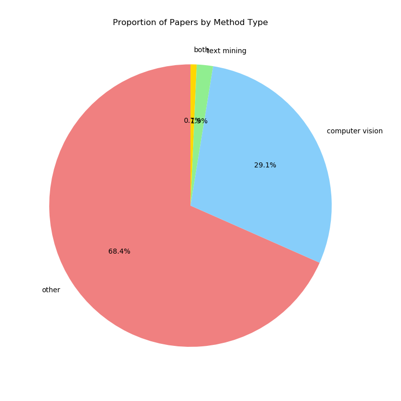
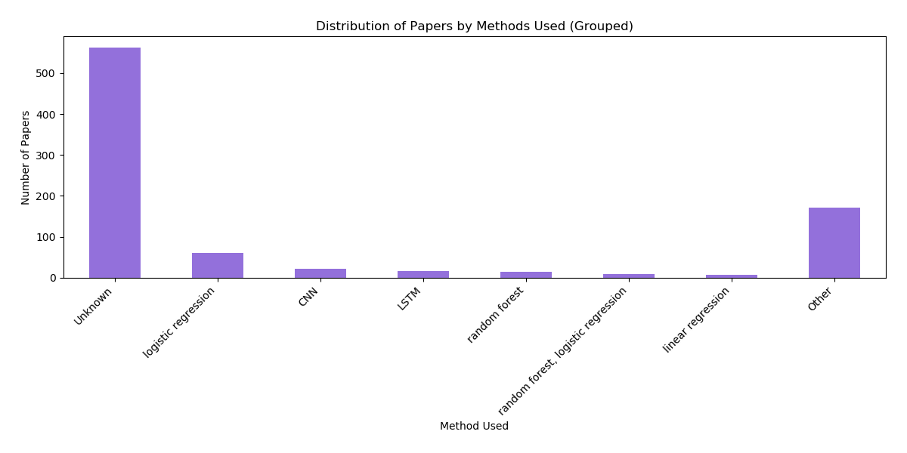
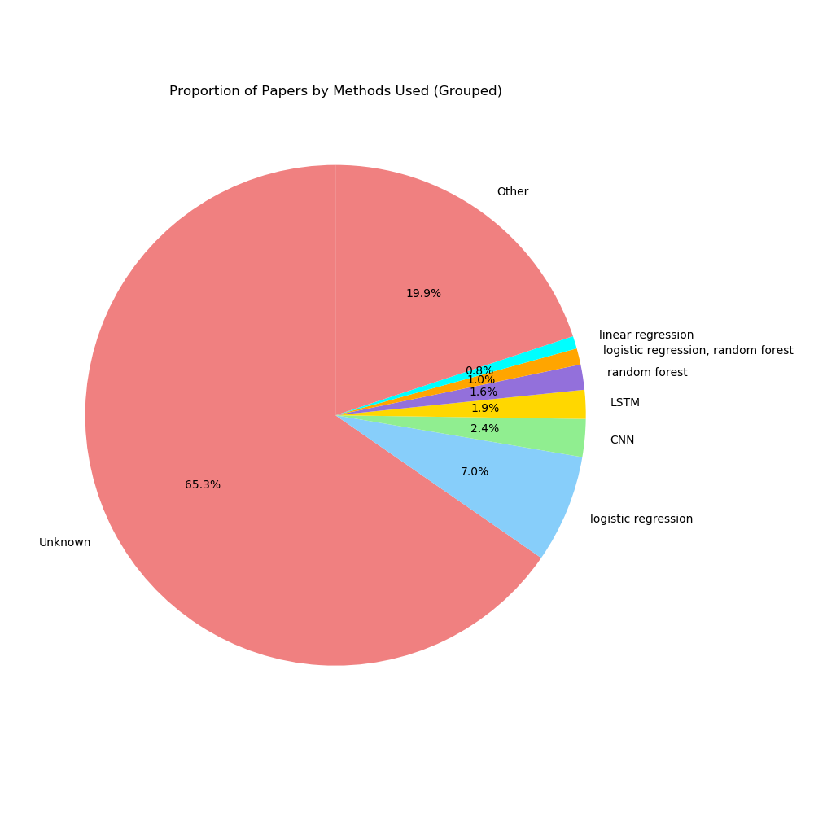

# Semantic Analysis and Classification of Virology Papers

## Overview

This [NLP Screening Task](https://github.com/gen6scp/nlp_screening_task) is focused on filtering, classifying, and extracting information from a dataset of academic papers related to deep learning techniques applied in virology and epidemiology. The main objective is to identify papers utilizing different types of deep learning methodologies, classify them, and visualize the distribution through data plots.

The workflow consists of five major steps:

1. **Data Loading and Preprocessing**: Load the dataset, clean it, and prepare it for analysis.
2. **Filtering Relevant Papers**: Identify papers that are relevant to virology and epidemiology based on semantic similarity using a TF-IDF approach.
3. **Classifying Papers by Method Type**: Classify the relevant papers into categories like `text mining`, `computer vision`, `both`, or `other`.
4. **Extracting Methods Used**: Identify specific deep learning and machine learning methods mentioned in each abstract.
5. **Generating Visualizations**: Create plots that summarize the classification distribution.

## Requirements
To run this project, the following Python packages are required:

- `pandas==1.5.3`
- `scikit-learn==1.2.0`
- `matplotlib==3.7.1`
- `numpy==1.23.5`

You can install these packages using:
```sh
pip install pandas==1.5.3 scikit-learn==1.2.0 matplotlib==3.7.1 numpy==1.23.5
```

## Running the Workflow

The main script requires the following arguments:
1. The input CSV file containing the collection of abstracts.
2. The output CSV file where the filtered and classified results will be saved.
3. (Optional) A threshold value for grouping less frequent methods in the visualization, defaulting to 7.
4. (Optional) A similarity threshold for TF-IDF filtering, defaulting to 0.1.

Example command to run the script:
```sh
python semantic_nlp_pipeline.py collection_with_abstracts.csv output.csv --threshold 7 --similarity_threshold 0.1
```
- **collection_with_abstracts.csv**: The path to the input CSV file containing paper data.
- **output.csv**: The path to save the filtered, classified papers with extracted method information.
- **--threshold**: (Optional) Threshold value for grouping less common methods in the plots (default: 7).
- **--similarity_threshold**: (Optional) Similarity threshold for TF-IDF-based filtering (default: 0.1).

## Workflow Steps Explained

### 1. Data Loading and Preprocessing
The first step is to load the provided dataset (`collection_with_abstracts.csv`) and clean it by removing rows without an abstract. This ensures that we only process papers containing meaningful content.

### 2. Filtering Relevant Papers
This step involves using **TF-IDF (Term Frequency-Inverse Document Frequency)** vectorization combined with **cosine similarity** to filter relevant papers. The abstracts are transformed into numerical feature vectors, and then compared against predefined topics such as "deep learning", "neural network", "virology", and "epidemiology". Papers with a cosine similarity above a set threshold (default 0.1) are selected as relevant.

#### Why is this approach more effective than keyword-based filtering?

- **Context Understanding**: TF-IDF captures the importance of terms relative to the entire dataset, making it possible to consider context and term relevance beyond simple word matching.
- **Synonym Handling**: Unlike basic keyword matching, TF-IDF combined with cosine similarity can identify relevant papers even if they use synonyms or different phrasings that convey the same meaning.
- **Higher Precision and Recall**: This method helps increase recall (finding more relevant papers) without significantly reducing precision, compared to direct keyword matching which often results in either over-selection or missing relevant documents.

### 3. Classifying Papers by Method Type
The filtered papers are classified into categories based on keywords found in their abstracts:

- **Text Mining**: Keywords like "text mining", "natural language processing", and "nlp".
- **Computer Vision**: Keywords like "image", "segmentation", "cnn", and "convolutional".
- **Both**: If both sets of keywords are found.
- **Other**: If none of these categories match.

### 4. Extracting Methods Used
The script extracts the specific deep learning and machine learning methods mentioned in each abstract using regular expressions to find methods such as `CNN`, `RNN`, `transformer`, `SVM`, `Random Forest`, etc. This gives a detailed overview of the computational techniques used in the papers.

### 5. Generating Visualizations and Statistical Insights
The final step involves generating visual summaries to better understand the dataset:

- A **bar chart** (`distribution_of_papers_by_method_type.png`) that shows the number of papers in each category.
- A **pie chart** (`proportion_of_papers_by_method_type.png`) that visualizes the proportions of different classification types.
- A **bar chart** (`distribution_of_papers_by_methods_used_grouped.png`) that displays the distribution of specific methods used, with less common methods grouped into an "Other" category for readability.
- A **pie chart** (`proportion_of_papers_by_methods_used_grouped.png`) to show the proportion of each method used in a more compact form.

Finally, this step displays summary tables of `methods type` and `method used`.


## Outputs

The script produces the following outputs:

### Filtered and Classified CSV File

The output CSV file contains the filtered list of papers with additional columns for `method_type` and `methods_used`. This provides a comprehensive view of the relevant techniques utilized in each paper.

### Data Visualizations

#### Bar Chart: 

Displaying the number of papers in each method category (`text mining`, `computer vision`, `both`, `other`).


  
#### Pie Chart: 

Displaying the proportion of each method type category to understand the overall distribution more visually.



#### Bar Chart for Methods Used (Grouped):

Displaying the number of papers using each method, with less common methods grouped into an "Other" category to improve readability.



#### Pie Chart for Methods Used (Grouped):

Displaying the proportion of each method, grouped for readability.



The generated plots provide an insightful look at the different types of methodologies covered in the papers, making it easier to understand the focus areas of deep learning and machine learning applications in virology and epidemiology.

## Results

### Resulting Dataset Statistics

After running the workflow, the resulting dataset is filtered based on the semantic similarity to target topics. 

The following are the resulting dataset statistics:

```
Statistical Overview:
Total number of papers: 860

Number of unique method types: 4
Most common method type: other (588 occurrences)

Top Method Types by Frequency:
       Method Type  Frequency  Percentage
0            other        588   68.372093
1  computer vision        250   29.069767
2      text mining         16    1.860465
3             both          6    0.697674


Number of unique methods used: 117
Most common method used: Unknown (562 occurrences)

Top Methods by Frequency:
                               Method  Frequency  Percentage
0                             Unknown        562   65.348837
1                 logistic regression         60    6.976744
2                                 CNN         21    2.441860
3                                LSTM         16    1.860465
4                       random forest         14    1.627907
5  random forest, logistic regression          9    1.046512
6                   linear regression          7    0.813953
7                           Inception          6    0.697674
8  decision tree, logistic regression          6    0.697674
9                         autoencoder          5    0.581395

```

These statistics and visualizations can be helpful for researchers or analysts who want to understand the trends in deep learning and machine learning applications across virology-related literature.

- **Total Number of Papers After Filtering**: The filtered dataset contained 860 papers deemed relevant based on TF-IDF cosine similarity (=0.1), ensuring high relevance.
- **Distribution by Method Type**: 
  - **Other**: 68.4% (approximately 588 papers)
  - **Computer Vision**: 29.1% (approximately 250 papers)
  - **Text Mining**: 1.9% (approximately 16 papers)
  - **Both**: 1.2% (approximately 6 papers)

The distribution by method type indicates that the majority of the filtered papers fall into the "other" category, with computer vision being a major focus among the rest.

- **Most Common Methods Used**: The distribution of specific methods used in the filtered papers includes:
  - **Unknown**: 65.3% of papers did not explicitly mention a recognizable method, indicating these abstracts did not specify computational methods clearly.
  - **Logistic Regression**: 7.0% of papers, showing this is a frequently applied technique.
  - **Deep Neural Network (DNN)**: 4.3% of papers utilize **CNN** (2.4%) + **LSTM** (1.9%) methods. 
  - **Other**: 19.9%, where less common methods are grouped.
  - Smaller but notable mentions included method like **Random Forest** (1.6%).

  These results highlight the predominance of certain traditional and straightforward machine learning methods, such as logistic regression. Although we did not check the correlation between year published and methods used, DNN may have a notable rise in recent years.


## Docker Environment

To set up and run this project using Docker, use the provided [docker-compose.yml](docker-compose.yml) and [Dockerfile.nlp](Dockerfile.nlp). Here are the commands to build and run the Docker container:

```sh
$ docker-compose build
$ docker-compose run nlp /bin/bash
```

In the Docker container, run the following command.
```
python semantic_nlp_pipeline.py collection_with_abstracts.csv output.csv --threshold 7 --similarity_threshold 0.1
```

## License
This project is licensed under the MIT License. Please see the `LICENSE` file for more details.

# nlp_screening_task
